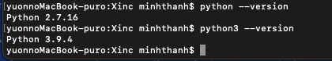

# _Pano_Cube_Pano_Convert_

## 1. Install Python3.x
- Download here
https://www.python.org/downloads/

- Check python version
```sh
python --version
python3 --version
```

=> use python3

## 2. Install pip3
- Install
```sh
curl https://bootstrap.pypa.io/get-pip.py -o get-pip.py
python3 get-pip.py
```

- Check pip3 version
```sh
pip3 --version
```
## 3. Install pakages from requirement.txt 
```sh
pip3 install -r requirements.txt
```

## 4. Run
```sh
python3 pano_cube_main.py
```
